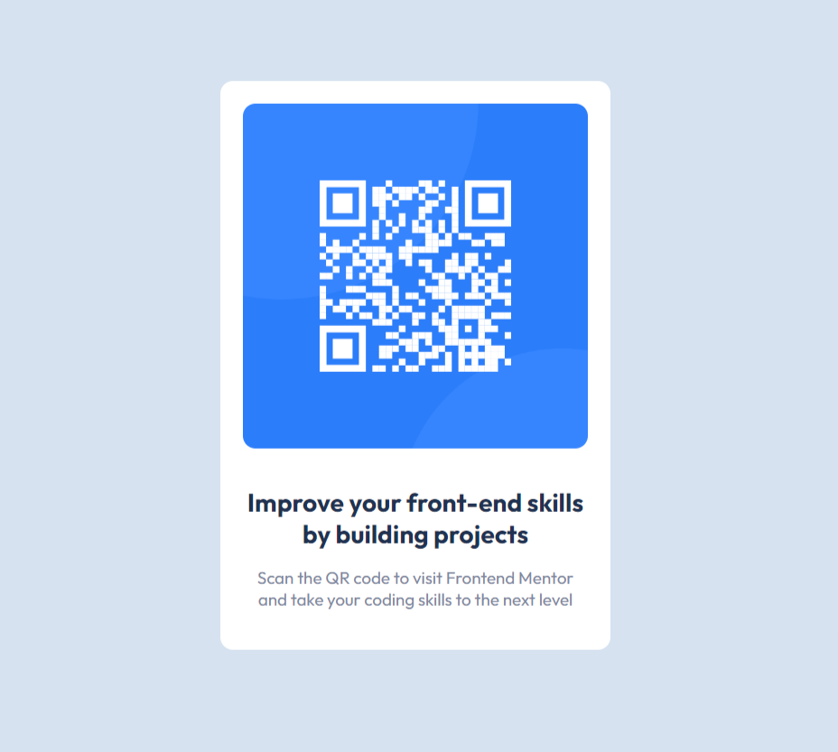

# Frontend Mentor - QR code component solution

This is a solution to the [QR code component challenge on Frontend Mentor](https://www.frontendmentor.io/challenges/qr-code-component-iux_sIO_H). Frontend Mentor challenges help you improve your coding skills by building realistic projects.

## Table of contents

- [Screenshot](#screenshot)
- [Links](#links)
- [Built with](#built-with)
- [What I learned](#what-i-learned)
- [Continued development](#continued-development)
- [Useful resources](#useful-resources)
- [Author](#author)

### Screenshot

### Links

- Solution URL: [Add solution URL here](https://your-solution-url.com)
- Live Site URL: [Add live site URL here](http://127.0.0.1:5500/index.html)

### Built with

- HTML5 markup
- CSS custom properties
- Flexbox

### Continued development

Kinda hard in the beginning but can solve this challenge was really satisfying, note to myself to remember even when i find difficulty, just give time.

### Useful resources

- [Example resource 1](https://www.w3schools.com/) - This helped me with css struggles
- [Example resource 2](https://www.youtube.com/watch?v=aINs3ouaoJk&ab_channel=JavaF%C3%A1cil) - Help me with the github settings

## Author

- Frontend Mentor - [@BauruScript](https://www.frontendmentor.io/profile/BauruScript)
- Twitter - [@cara_de_hamster](https://twitter.com/cara_de_hamster)
